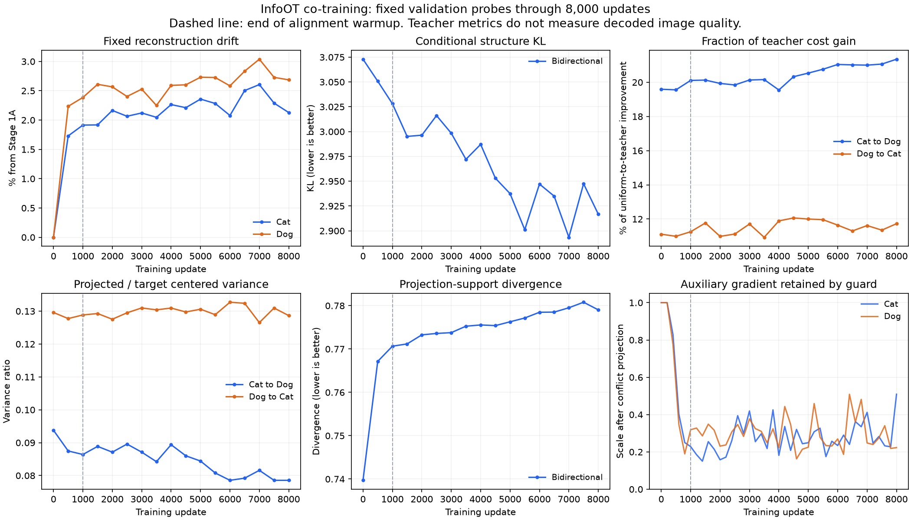

# Review of the guarded 8,000-update InfoOT run

Inputs: `results/lora-64/logs/train.jsonl` and `validation.jsonl`. The input
folder contains logs, not decoded grids. The findings below concern latent
geometry, the frozen structural teacher, and a small reconstruction probe.

## Result

The run learns slowly but has not established useful image translation.
The solver is healthy; conditional matching improves little, the support
divergence worsens, and projected means remain strongly contracted. Extending
the same configuration further is not the next experiment recommended here.

There are 41 training observations and 17 fixed validation probes from
step 0 through step 8,000, without duplicate steps. Validation IDs are
identical across probes: 96 training references and 32 validation queries
per domain. Reconstruction uses eight validation samples per domain. All
probes use raw encoder weights, rather than EMA.

| Fixed probe | Step 0 | Step 1,000 | Step 4,000 | Step 8,000 |
| --- | ---: | ---: | ---: | ---: |
| Cat reconstruction | 0.67257 | 0.68544 | 0.68779 | 0.68688 |
| Dog reconstruction | 0.60979 | 0.62434 | 0.62560 | 0.62617 |
| Conditional KL, bidirectional | 3.07293 | 3.02806 | 2.98709 | 2.91679 |
| Cat-to-Dog expected structure cost | 0.94110 | 0.93952 | 0.94123 | 0.93574 |
| Dog-to-Cat expected structure cost | 0.99107 | 0.99079 | 0.98955 | 0.98987 |
| Cat-to-Dog projected/target variance | 0.09378 | 0.08640 | 0.08938 | 0.07855 |
| Dog-to-Cat projected/target variance | 0.12960 | 0.12885 | 0.13095 | 0.12865 |
| Projection-support divergence | 0.73970 | 0.77065 | 0.77555 | 0.77904 |

The exact extracted values and input hashes are in
[`summary.json`](analysis/stage1b_guarded_8000/summary.json); all 17 probes are
in the [comparison table](analysis/stage1b_guarded_8000/validation.md).



Relative to step 0, KL falls about 5.1%, and reconstruction increases about
2.13% for Cat and 2.69% for Dog. Expected structural cost falls only 0.57%
Cat-to-Dog and 0.12% Dog-to-Cat. By step 8,000 the conditional readout captures
about 21.3%/11.7% of the cost improvement available between a uniform readout
and the structural teacher. These are training-prior metrics, not independent
semantic measurements. The small fixed probes do not provide error bars for
population image quality.

For context, the [previous unguarded 1,000-update probe](stage1b_projection_1000_review.md)
reached KL 2.8803 with roughly 2.0%/2.8% reconstruction drift. The guarded
8,000-update run therefore does not show a clear benefit from the previous
package of loss-weight, support-loss, and gradient-guard changes. Because
several settings changed together, this comparison cannot isolate one cause.

Every logged InfoOT solve reports inner and outer convergence. Effective
target counts in the minibatch fit stay around 25-26. Stable plan entropy
does not establish an implementation failure or useful correspondence.
The late training windows also change little: mean window KL moves from
2.5500 over steps 1,000-3,000 to 2.5136 over 5,001-8,000, while support loss
rises from 0.7776 to 0.7833. These aggregate the logged 100-update windows;
they are not averages of all individual updates, which were not saved.

At all 36 logged observations from step 1,000 onward, both encoders' auxiliary
gradients hit the 0.25 norm cap. The mean retained scales are 0.275 for Cat
and 0.299 for Dog. Mean cosines with the primary gradient are near zero
(-0.0055/-0.0069), although their signs vary. Much of the reduction is due
to the norm cap, not a large opposing component. This motivates providing
alignment-specific parameters outside that encoder cap; it does not prove
the cap is the only bottleneck. Simply increasing all encoder gradients could
also increase drift in the decoder's conditioning codes.

## Correcting the distribution-loss assumption

The earlier support-loss addition did not show benefit in this run. There is
also a conceptual limitation: conditional means generally do not have the
same distribution or variance as target samples. The law of total variance
gives, componentwise or using the covariance trace,

```text
Var(Y) = Var(E[Y | X]) + E[Var(Y | X)].
```

For finite teacher weights `t_ij`, take queries uniformly and target masses
`b_j = mean_i(t_ij)`. The same identity holds exactly for the teacher means
`mu_i = sum_j t_ij z_j`. Unless each conditional distribution is deterministic,
matching the means' distribution to that target mixture is a different goal
from estimating the conditional expectation. Debiasing the entropic OT
distance does not remove this distinction.

The revised experiment therefore disables the support loss and preserves its
implementation/config as a control. Lower variance alone is not necessarily
an error; the important questions are whether the learned probabilities
capture source structure and whether their means work with the frozen decoder.
New diagnostics report the teacher's between-mean and within-conditional
variance. Norm recovery is not a selection criterion: in this run
Cat-to-Dog norm ratio increases from 0.360 to 0.394 while its centered variance
ratio decreases.

## Research and revised architecture

[SimCLR, Chen et al. (2020), Section 4](https://proceedings.mlr.press/v119/chen20j.html)
studies a learned nonlinear head between a representation and its training
loss. It motivates giving the alignment objective its own representation,
while retaining information in the representation used by another task.
Our residual head is an adaptation of that separation: unlike SimCLR, it
remains necessary during matching at inference. This is not a SimCLR
reproduction or evidence of a Cat/Dog quality improvement.

[Relational Knowledge Distillation, Park et al. (2019)](https://arxiv.org/abs/1904.05068)
transfers relationships between examples. That motivates applying our
existing frozen-structure neighborhood KL to the matching heads. Our KL
objective is not RKD's original distance/angle loss. The DINO structure cache,
teacher temperature, and conditional KL are unchanged; independent labels
remain necessary to detect teacher shortcuts.

The [official InfoOT code](https://github.com/chingyaoc/InfoOT/blob/main/infoot.py)
fits kernels on supplied features, solves Fused InfoOT with the cost
`C - lambda * grad(MI)`, and projects using density-ratio weights. It does
not define neural co-training. The active mathematical solver and full
conditional readout retain those operations. Learned matching features and
averaging separate raw decoder values are explicit project extensions.

The new path is:

```text
image latent -> encoder E -> raw semantic code z -> frozen domain generator
                                 |
                                 +-> learned matching head m -> InfoOT KDE/plan

target output code = sum_j Eq7_weight(m_source(z_x), m_target(z_j)) * raw_z_j
```

Each head is a residual MLP with 512 input/output dimensions, a 256-wide
hidden layer, LayerNorm without affine parameters, and GELU. Its last linear
layer starts at zero, making initial matching features exactly the normalized
raw-code baseline up to floating-point roundoff. No batch statistics couple
validation queries to training data. Matching initialization preserves the
training RNG state.

Both encoders and both heads train. Generators, learned null tokens, adapters,
and rank-64 LoRA stay frozen. The encoder update retains the existing 0.25
auxiliary-gradient cap. Heads receive the full weighted auxiliary gradient
through a separate Adam parameter group; their gradients are clipped
separately, and do not consume the encoder cap. Reconstruction and anchoring
operate on raw codes. Neighborhood KL, MI, and conditional readout use the
matching features. There is no direct cross-domain distance between raw Cat
and Dog code coordinates.

Conditioning now uses learned coordinates `m(z)`, which need not preserve all
information in `z`. The output remains a convex combination of all declared
target raw codes, with target smoothing and density correction. A learned
head cannot recover structure absent from the encoder, and a conditional
mean may remain unsuitable for image generation even with correct matching.
[Fatras et al. (2020)](https://proceedings.mlr.press/v108/fatras20a.html)
also show that minibatch OT changes the effective transport problem. This
revision still fits minibatch plans; it does not eliminate minibatch bias.

## Settings and Linux workflow

The existing `structure_fused_projection_sit_b2.yaml` remains the 8,000-step
guarded control. The new opt-in configs are
`configs/stage1b_infoot/structure_metric_sit_b2.yaml` and its evaluation
counterpart. The official-based snapshot under `legacy/infoot_official_v1`
is untouched.

| Setting | Guarded control | Matching-head experiment |
| --- | ---: | ---: |
| Encoder LR | 2e-5 | 2e-5 |
| Matching-head LR | none | 2e-4 |
| Encoder auxiliary norm cap | 0.25 | 0.25 |
| Conditional KL weight | 0.02 | 0.02 |
| Neighborhood KL weight | 0.10 | 0.10, on matching features |
| Support-divergence weight | 0.02 | 0, disabled |
| Fit / projection bandwidth | 0.70 / 0.10 | 0.70 / 0.10 |
| Inner MI / outer alignment weight | 0.10 / 0.20 | 0.10 / 0.20 |
| Entropy regularization | 0.05 | 0.05 |
| Budget / warmup | 8,000 / 1,000 | 8,000 / 1,000 |

These learning rates are starting settings, not measured optima. Keep the
same cached data and frozen DINO descriptor bank. From the Linux project root:

```bash
# New experiment from the configured Stage 1A EMA weights, full 8k budget.
python3 scripts/train_joint_infoot.py \
  --config configs/stage1b_infoot/structure_metric_sit_b2.yaml

# Standalone evaluation; a matching Stage 1A report is optional.
python3 scripts/evaluate_infoot_alignment.py \
  --alignment-config configs/stage1b_infoot/structure_metric_sit_b2.yaml \
  --eval-config configs/stage1b_eval/structure_metric_sit_b2.yaml \
  --checkpoint outputs/stage1b_cat_dog_structure_metric_infoot_sit_b2_cfg_adaln_all_lora_r64/checkpoints/latest.pt
```

Inspect early checkpoints after warmup before committing more compute. To
stop at step 2,000, add `--max-steps 2000` to training, then continue that
same new experiment with `--resume`. Do not resume the guarded checkpoint
into this architecture; its optimizer and matching state differ. Old runs
remain evaluable with their original configs.

New checkpoints contain raw/EMA encoder and matching-head states, optimizer
groups, configuration, and existing provenance. Evaluation loads raw with
raw or EMA with EMA, and rejects missing head state. Exported banks include
both raw codes and matching features plus a fingerprint of the head; banks
from different matching states cannot be mixed. Nearest-target distance and
barycentric-neighbor controls compare raw codes in the same coordinate
system. Future Stage 2-4 artifacts must carry the head weights/config and
fingerprint along with the encoder, kernels, raw bank, and transport plan.

The new decoded grid has five rows when the descriptor cache covers its queries:

1. Source image.
2. Full InfoOT conditional mean.
3. Selected target code.
4. Sampled target code.
5. Direct structural-teacher mean, using the same target noise and CFG.

The fifth row bypasses InfoOT and uses the teacher's soft probabilities over
the full target bank. It is a diagnostic reference, not a ground-truth pair
or the deployed mapping. The report records actual grid rows. If the teacher
mean already produces poor structure/realism, closer teacher agreement alone
will not fix that problem. If it is useful but the InfoOT mean is poor, the
matching/readout remains a candidate bottleneck. Inspect both translation
directions and independent viewpoint/framing/color precision with nonzero
label coverage; logs alone cannot decide image faithfulness.

To isolate the architecture change, copy the guarded control to a different
output directory and disable `projection_support.enabled` with weight zero.
Compare that control with the head experiment. A separate head-only control
can use `train.lr_encoder: 0` in a copied head config, keeping encoder codes
fixed while heads learn. No one-run result establishes which change helps.

Regenerate the log table/plots without loading any model:

```bash
python3 scripts/summarize_infoot_training.py \
  --log-dir results/lora-64/logs \
  --output-dir outputs/guarded_8000_review --plot
```

Omit `--plot` if Matplotlib is unavailable. The summary reports duplicate
steps, fixed-ID consistency, input hashes, and sampled gradient-guard statistics.

## Verification

Local CPU checks cover initial identity and RNG isolation, conditional
learning with fixed raw codes and a fixed plan, raw/EMA head restoration,
training/resume with both encoders and both heads, frozen generators, bank
fingerprints, raw versus matching coordinate handling, and total-variance
identities. The learned-head synthetic test establishes that the mechanism
can fit a structural relation; it does not establish AFHQ generalization.
No AFHQ GPU training or real-image decoding of the new experiment was run
locally. Test results are reported with the implementation handoff.

The focused InfoOT/training/evaluation suite passes 94 tests, including the
new matching-head and variance checks. The preserved legacy suite passes 77.
The repository-wide run has the existing latent-flip fixture failure
(`[1,4,4]` supplied versus default `[4,32,32]` expected); its loader and fixture
are unchanged by this work.
